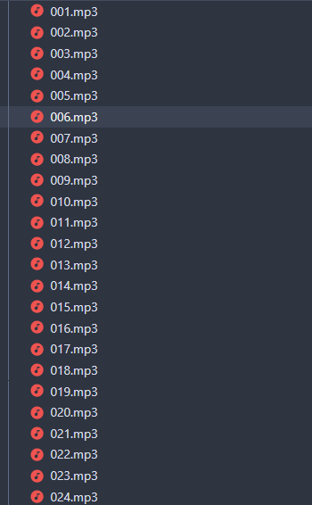
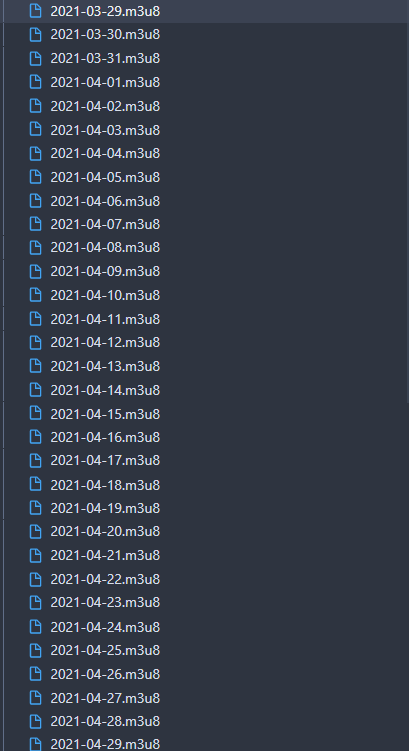

## 利用艾宾浩斯遗忘曲线生成课文复习播放列表

### 开发原因

以前学习英语的时候,还是在记事本上利用艾宾浩斯曲线的方法,画出表格,记录每天的学习状态.
现在要学习日语,也想着用一样的方法,但是手写的不方便管理,而且效率也不高,就想着用程序
来生成每天要复习的课文.参考了[这个](https://github.com/Nancyberry/ebbinghausGenerator).

### 开发过程

想法是 lessons 目录存放要学习的课文音频文件,默认是从明天开始算,一天学习一课.然后输入 mp3 播放列表文件.一开始还在手机上试了很多不同播放器,发现只有[poweramp](https://powerampapp.com/)满足批量导入列表的要求.

### 程序使用



1. 在 lessons 文件中放入要学习的课文,文件排列顺序就是你要学习的顺序

```shell
python main.py
```


上图是生成结果

2. 将 lessons 和 playlist 文件夹放入手机

3. 利用 poweramp 导入 playlist 文件夹

4. 每天通勤的时候循环当天的播放列表就行了

感谢[ebbinghausGenerator](https://github.com/Nancyberry/ebbinghausGenerator)
